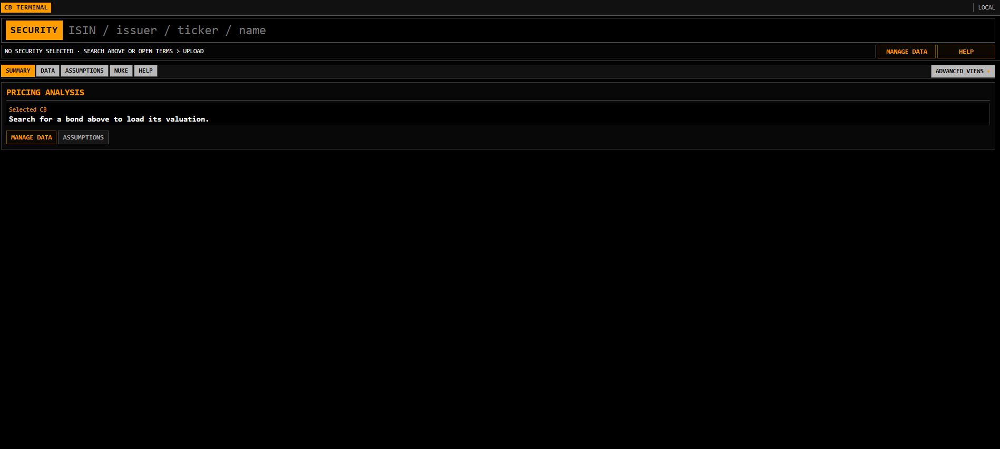

# CB Terminal

Local web application for convertible bond data intake, contract review, market-data processing, valuation, and analysis.

## Requirements

- Python 3.11+
- PyMuPDF for PDF text extraction (installed with the `prospectus` extra)

## Setup

```bash
python -m venv .venv
```

Activate the environment:

```powershell
# Windows PowerShell
.venv\Scripts\Activate.ps1
```

```bash
# macOS or Linux
source .venv/bin/activate
```

Install and start the application:

```bash
python -m pip install -e ".[prospectus]"
python -m cb_terminal.cli.serve --host 127.0.0.1 --port 8000
```

Open `http://127.0.0.1:8000/`. The user guide is available at `/help`.

## Workflow

1. Upload a PDF termsheet or prospectus and CSV/XLSX market-price files.
2. Review extracted terms, resolve flagged gaps, and approve the contract.
3. Match the convertible bond, equity, and FX identifiers.
4. Build valuation history and review outputs and pricing scenarios.


## Notes

The application uses a simplied valuation model, see [VALUATION_MODEL.md](VALUATION_MODEL.md).

## Interface


